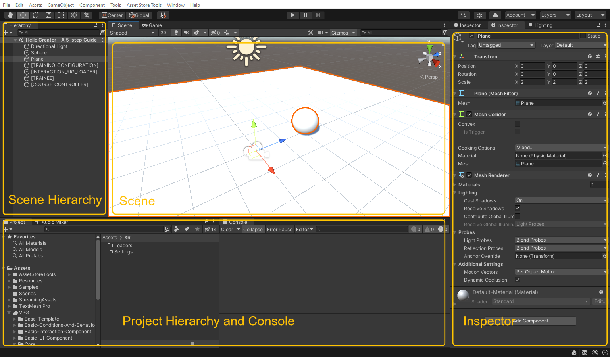
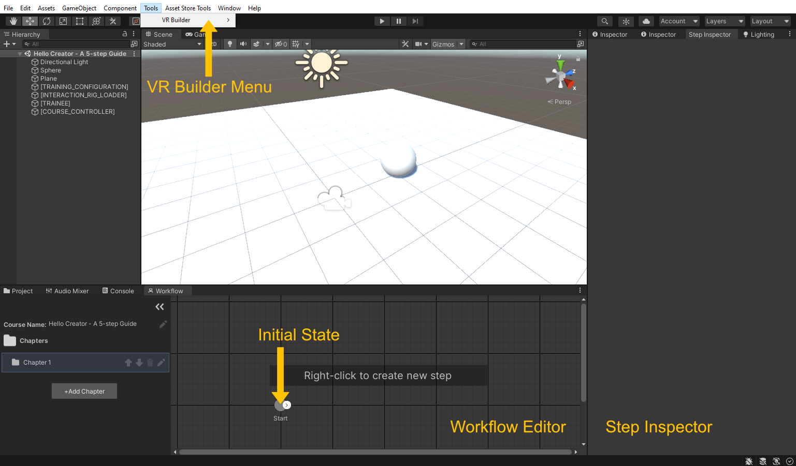
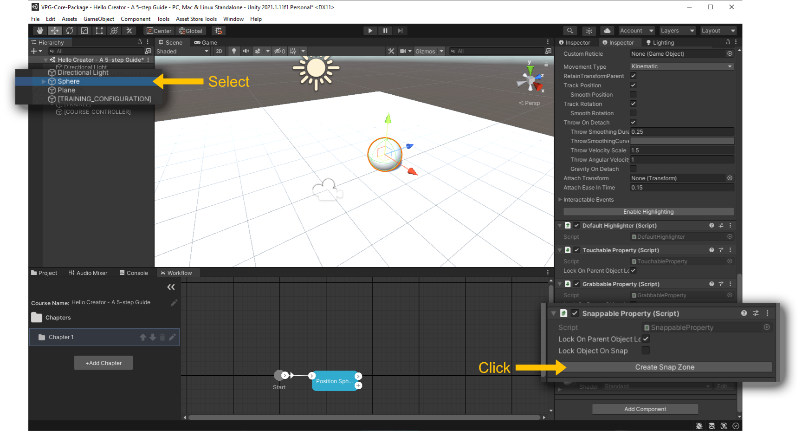

# Acknowledgements

VR Builder is based on the open source edition of the [Innoactive Creator](https://www.innoactive.io/creator). While Innoactive helps enterprises to scale VR training, we adopted this tool to provide value for smaller content creators looking to streamline their processes. 

We too believe in the value of open source and will continue to support this approach together with Innoactive and the open source community around it.

This guide was originally part of the Innoactive Creator documentation. As some functionalities of VR Builder are similar to the original Creator, it may also be useful to check the [documentation for the Innoactive Creator](https://developers.innoactive.de/documentation/creator/v2.11.1/).

# Getting Started with VR Builder

This guide outlines the first steps after successfully importing VR Builder. It will help you to create your first basic process in 5 steps. During the process, you will get familiar with the basic user interface of the Unity Editor and VR Builder. You will also learn the basic concepts required to successfully create a process using VR Builder.

## Step 1: Create Process

In case you are new to Unity, you see an empty Unity project, which usually includes a **Scene** window, a **Hierarchy** of 3D objects of your scene. This is currently empty and only contains a `Main Camera` and `Directional Light`, the Inspector (might also be empty currently), and on the lower end of the Unity window, a **Project Hierarchy and Console** window (see figure 1).

*Figure 1: Get familiar with Unity windows: hierarchy, scene, inspector and project hierarchy and console.*

After importing VR Builder, you will have a new element in the `Tools` menu, called `VR Builder` (see Fig. 2). A `Create New Process` Wizard is open.

  > After Importing, the `Create New Process` Wizard should open. In case it is not open, select `Create New Process...` from the menu `Tools > VR Builder`.

## Step 2: Select Demo Scene

The Wizard helps you to setup your project. You can start from an empty scene, but for the sake of this guide, we start with a simple demo scene.

> Select `Import step-by-step demo scene` in `Step 1: Setup Process`

## Step 3: Configure Hardware

> in the Wizard, select the Head-Mounted Device you want to run the process for in `Step 2: Setup Hardware`.

(note: if you do not see the Hardware setup as a step in the wizard, please follow through the wizard by clicking `next` until the wizard closes. Open `Edit` > `Project Settings`. In the opening window, select `XR Plugin Management` from the side menu. Please select your hardware under Plug-in Providers.

*Figure 2: The basic VR Builder Windows for process Creation.*

You see a new Scene was loaded: In the Scene window you see a `sphere`. New is the ***Workflow Editor*** window and the ***Step Inspector*** window (see figure 2). 

(note: The ***Step Inspector*** window opens when you create and select a new step by double-clicking). 

We recommend you place both windows as illustrated in the image above.
The ***Workflow Editor*** contains two circles, the large one represents the initial state of a workflow (see Fig. 2) and the small one is an outgoing connection currently not connected to anything.

## Step 4: Create a Simple Process Application

Let's take a minute to give an outlook on the process that will be built in this step. Often, want users to perform a sequence of physical actions in a certain order. Here, we want the user to:

1. Grab the sphere (which is visually highlighted)
2. Place it at a specific position

### Create the Workflow

A right-click into an empty area of the ***Workflow Editor*** window displays a contextual menu.

> select `add step`

A `new step` appeared on the Scene. The selected step can be configured in the ***Step Inspector*** window. On the very top of the ***Step Inspector*** window is the name and description of a step.

> change the step name to `Position Sphere`.
> draw a Connection line between the `initial state` and `Position Sphere` step.

### Configuring Steps

A `step` can be configured using `behaviors` and `conditions`. The list of `behaviors` and `conditions` can be extended with little developer effort to meet the needs of your company's applications. 
`Behaviors` prepare a scene for trainees. `Conditions` are actions expected from the trainee to move to the next step. We expect the trainee to grab the sphere (`condition`), which is visually highlighted (`behavior`), and we expect the trainee to place the sphere at a specific position (`condition`).

#### Behavior - Highlight the Sphere

> select the ‘Position Sphere’ step in the workflow.

Shift your attention to the opening/already opened ***Step inspector***. You see 3 tabs: ***Behaviors***, ***Transitions***, and ***Unlocked Objects***.

> select the Behavior tab and click the ‘Add Behavior’ button.
> select ‘Highlight Objects’ from the list of Behaviors.

‘Highlight Objects’ has two properties you can configure: the highlight color and the Object to highlight.

> drag the sphere object from the hierarchy into the ‘object to highlight’ field.

You get the warning that the 'Sphere is not configured as IHighlightProperty' with a `Fix it` button. VR Builder simplifies the process creation for users not necessarily familiar with Unity.

> click the `Fix it` button.

VR Builder will take care of configuring the underlying Unity Objects to make highlighting work.

 *Figure 3: The configured Highlight object behavior.*

#### Transition – Grab-and-place the Sphere

Placing an object implies you 'grabbed' it before. Thus, we integrated both actions into a single condition called `Snap Object`. It’s called 'snap' because when trainees approach the target position with the object, they can release the object and it will position and rotate itself into the target position. Imagine an electrical component that has to be precisely placed on to a circuit board. 

> select the 'Transitions' tab.

One `step` can have multiple `transitions` to other `steps`. Since your `step` does not have any, it displays by default 'Transition to the End of the Chapter'.

> click ‘Add Condition’ and select ‘Snap Object’ from the list of conditions.

The Snap Condition requires two objects `Object to snap` and `Zone to snap into`.

> drag the Sphere object from the hierarchy into the `Object to snap` and click the `Fix it` button.

Let’s inspect the `sphere` object: Select the `sphere` object in the ***Hierarchy*** window and open the ***Inspector*** window (see Fig. 1). You see a list of properties and scripts attached to this object, e.g. 'Box Collider' etc.

 *Figure 4: Create a snap zone. Select the sphere in the hierarchy, click Create Snap Zone button in the Unity inspector.*

> scroll down to `Snappable Property`. Click the `Create Snap Zone` button.

A new object `Sphere_SnapZone` appeared in the ***Hierarchy*** window.

> select and move the sphere _snapZone object in the Scene to a reachable nearby position.

Go back to the ***Step inspector*** window.
> drag-and-drop the sphere_SnapZone object into the ‘Zone to snap into’ property of the ‘snap object’ condition.

## Step 5: Start Course

Connect your Head-Mounted Device and start the application by hitting the play button in the top-center of the Unity window. Grab your controllers, move the controllers in VR into the solid Sphere object and press the 'select' button. This is usually different for every controller. The manual of you hardware should give you more information about how to find the correct controller button. When you have successfully grabbed the sphere, move it over to the 'snap zone' and release the button.

Congratulations! You successfully built a minimal application using VR Builder.
